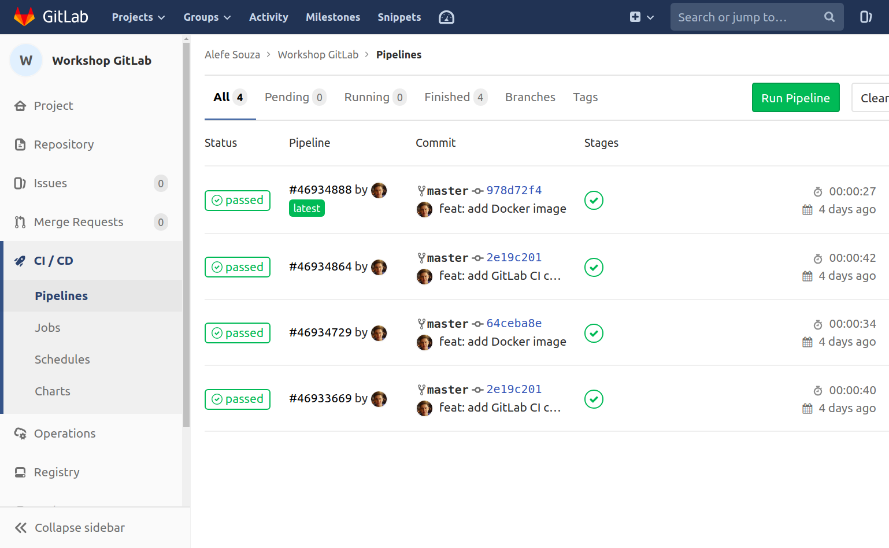
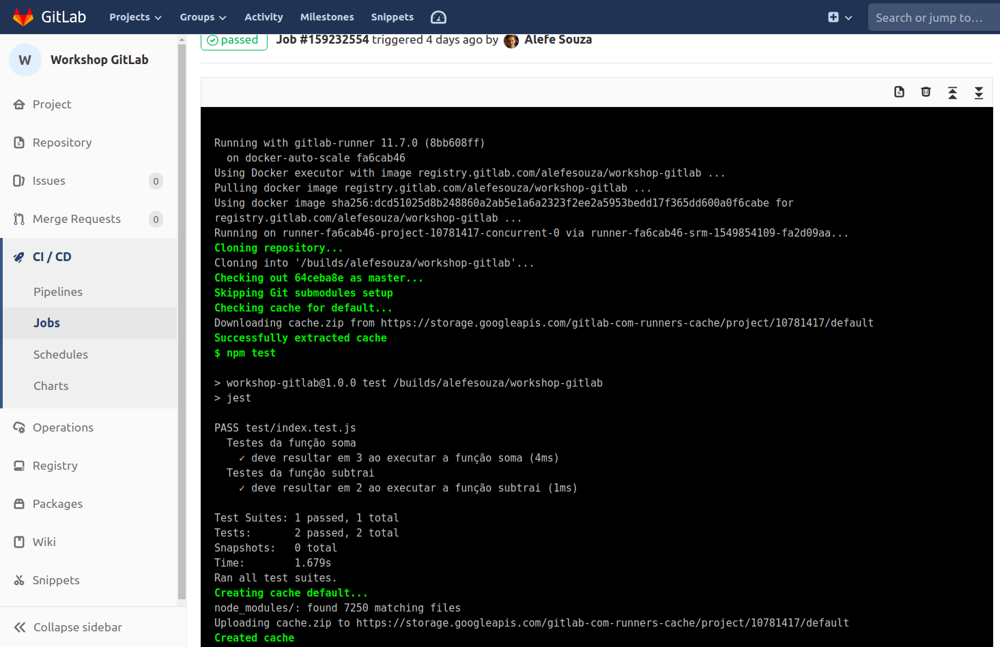

# Continuous Integration: GitLab CI

O [GitLab CI](https://about.gitlab.com/product/continuous-integration/) é uma ferramenta/servidor de Continuous Integration já integrado ao GitLab, para começar a utilizar, você apenas precisa criar um arquivo chamado `.gitlab-ci.yml` na raiz do seu projeto e colocar as instruções necessárias para a integração continua da sua aplicação, como queremos apenas rodar nossos testes, adicione o código a seguir a ele:

```yml
image: node:10.15.1-jessie

# services:
#   - mysql:5.7.20 # Caso precise, você pode subir serviços no servidor de CI, como um banco de dados como o MySQL por exemplo.

before_script:
  - npm install

# stages:
#   - build
#   - test
#   - staging
#   - production

cache:
  paths:
    - node_modules/

unit_test:
#   stage: test
  script:
    - npm test

# deploy_production:
#   stage: production
#   only:
#     - master # indica que só pode executar os comandos de production caso haja modificações na branch master.
#   script:
#     - npm run deploy # esse comando não funciona, mas você pode configurar para acessar o seu servidor via SSH e rodar o git pull e outros scripts após terminar os testes.
```

Na primeira linha dizemos que estamos utilizando a imagem Docker oficial do Node.js no [Docker Hub](https://hub.docker.com/_/node), que no caso seria o Node.js 10.15.1 rodando em uma imagem baseada na distribuição Linux Debian Jessie, uma versão bem leve do Debian normalmente utilizado em imagens Docker, nessa forma podemos rodar o `apt-get` para instalar dependências nela normalmente, você também consegue subir ambientes com outras linguagens de programação da mesma forma para rodar seus códigos e os testes, como [PHP](https://hub.docker.com/_/php), [Python](https://hub.docker.com/_/python) e [Go](https://hub.docker.com/_/golang), subir imagens públicas no Docker Hub e utilizá-las no GitLab CI, ou então subir imagens privadas no seu próprio repositório do GitLab como veremos a seguir.

Note as linhas com `unit_test` e `deploy_production`, elas não usam palavras reservadas, portanto o GitLab entende que deve subir uma máquina virtual para cada uma em seguida, ordenadas pelo "stages", por padrão a ordem é executar:

* `build`: Você pode fazer build da sua aplicação para ver se está tudo ok.
* `test`: Você coloca os comandos que testam sua aplicação.
* `staging`: Você pode enviar seu código para um servidor de homologação.
* `production`: Você pode por os comandos para enviar seu código para produção.

Todos são opcionais e você pode criar stages customizados na instrução `stages`, caso haja algum erro em qualquer um dos stages, os próximos não são executados, dessa forma impedindo que aplicações do erros vão para produção.

A instrução `before_script` indica os comandos que você quer que rode sequencialmente antes de começar a rodar qualquer um dos staging, o mais comum é o comando de instalar as dependências da aplicação.

Há também a instrução `cache`, que você pode por quais pastas você quer que continuem na próxima execução, desta forma o GitLab CI zipa essa pasta, e a baixa na próxima execução, agilizando o passo de instalar depedências por exemplo.

Existem muitas outras configurações que podem ser adicionadas ao `.gitlab-ci.yml`, você pode ver mais informações possíveis [clicando aqui](https://docs.gitlab.com/ce/ci/yaml/).

Após você enviar seu código com um _.gitlab-ci.yml_ ao GitLab, ele iniciará um servidor de CI automaticamente seguindo as instruções que você adicionou no mesmo, você pode acompanhar na opção CI/CD do painel lateral do seu repositório.




