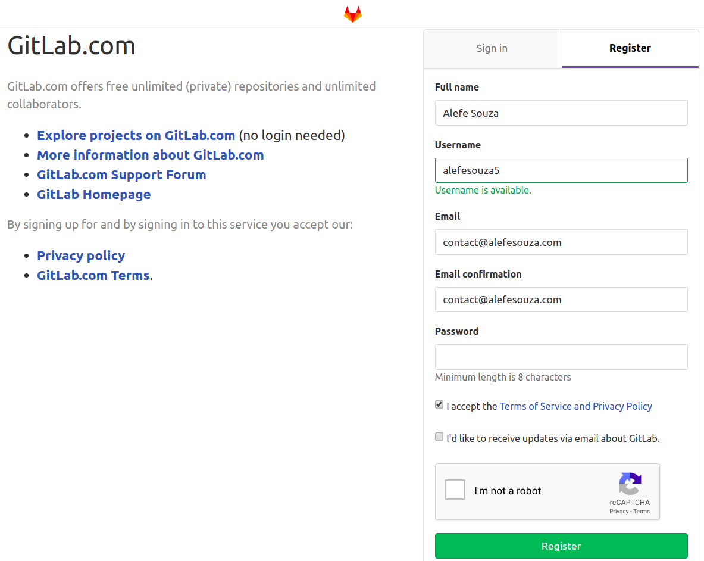
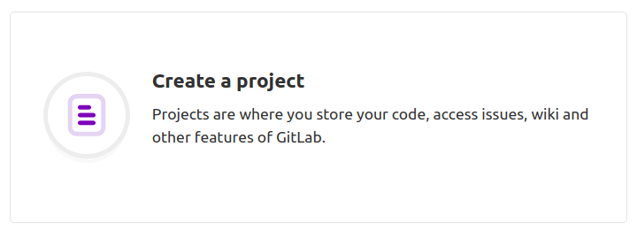
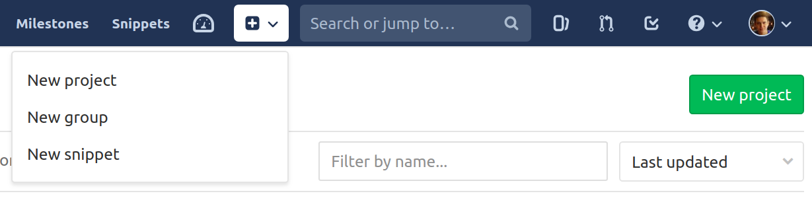
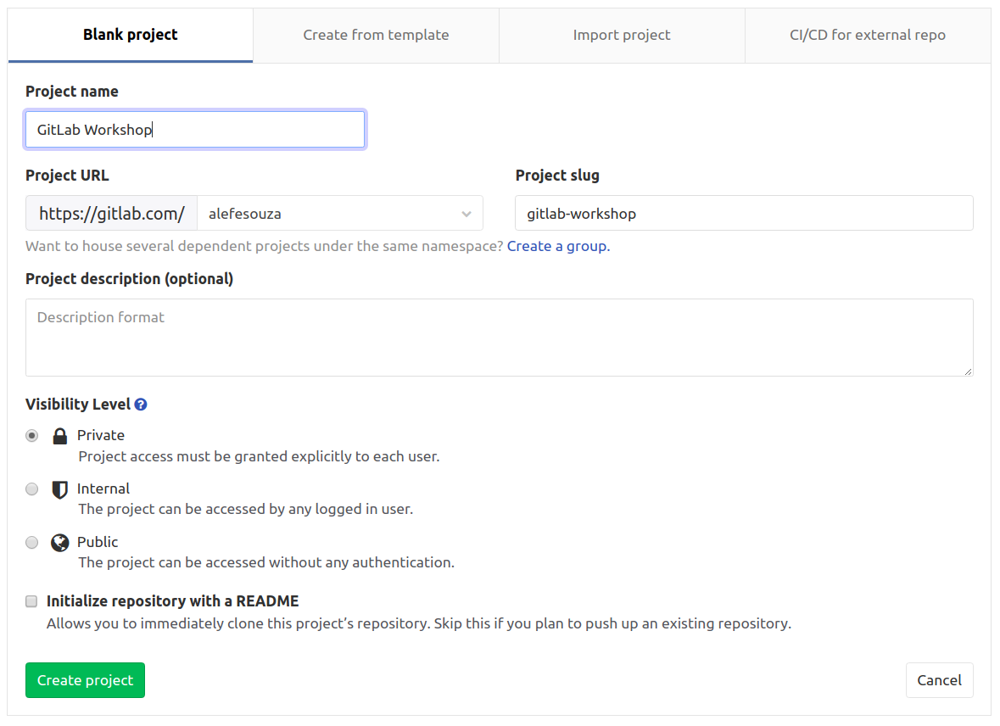
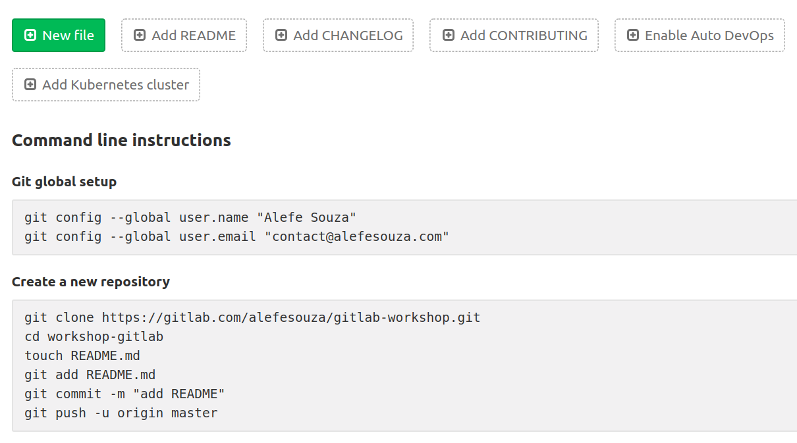

# Criar repositório

Para iniciar, crie uma conta ou faça login no GitLab [clicando aqui](https://gitlab.com/users/sign_in#register-pane), sugiro criar uma conta com login e senha e depois integrar com as redes sociais, pois iremos utilizar mais para frente.

Após isso, confirme seu e-mail caso peça, faça login, e com a conta já criada, clique no botão **New project** e dê um nome ao seu repositório em seguida.

Caso você já tenha usado o GitLab antes, provavelmente estará assim:

Na próxima dela, dê um nome ao repositório, como GitLab Workshop por exemplo:

Em seguida, com o Git já instalado, acesse alguma pasta para criarmos nosso projeto, abra o Terminal ou Prompt de Comando na mesma, e então rode os comandos que o GitLab sugere na página que se abriu, na parte **Git global setup** e em seguida **Create a new repository**:

